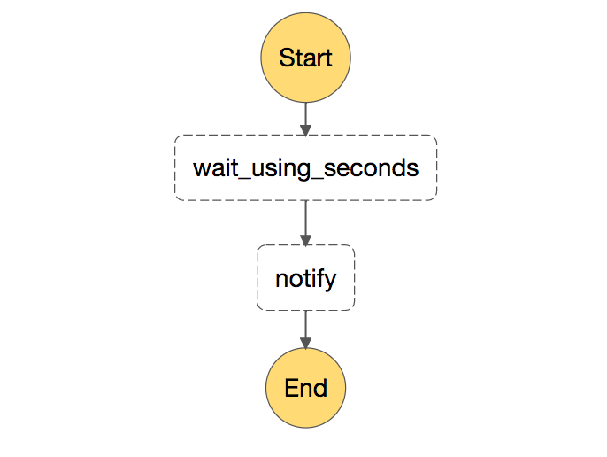

# Example Serverless Step Functions App: Timer

In this example we are going to build a small app which uses **AWS Step Functions** with **AWS Lambda Functions**.  

### Pre-requisites
* AWS account
* Nodejs
* Basic knowledge of API Gateway
* Serverless Framework https://serverless.com/
* Serverless Step Functions https://github.com/horike37/serverless-step-functions

### Workflow of the Step Machine

